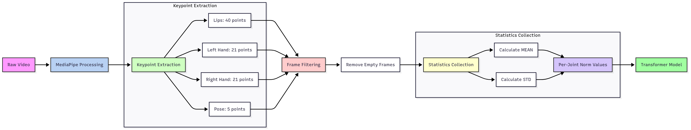
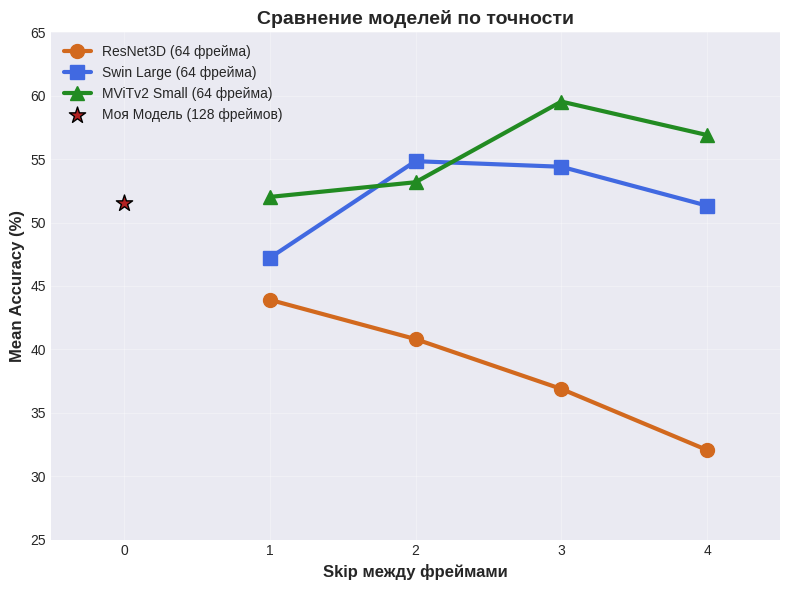
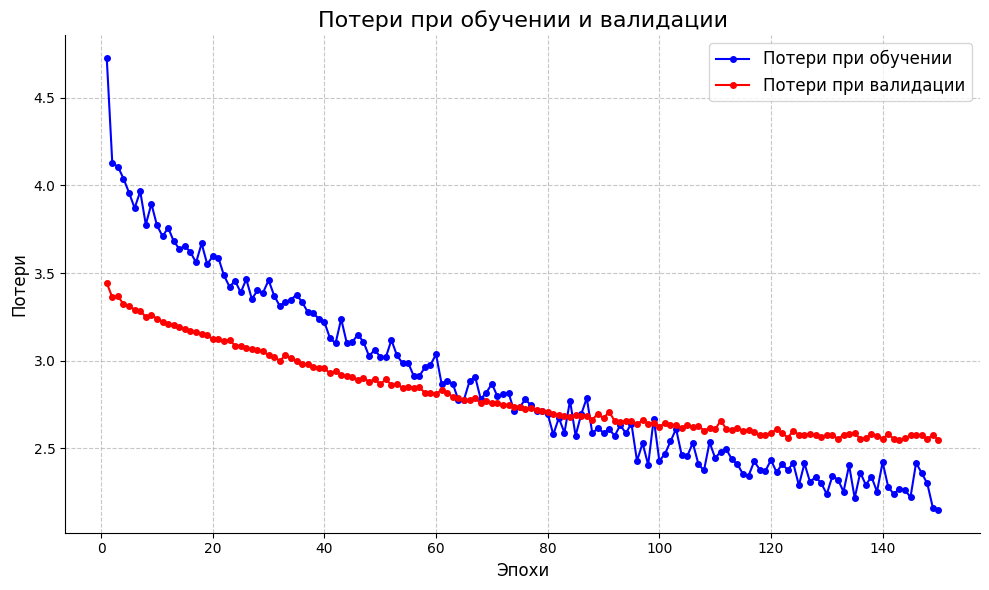
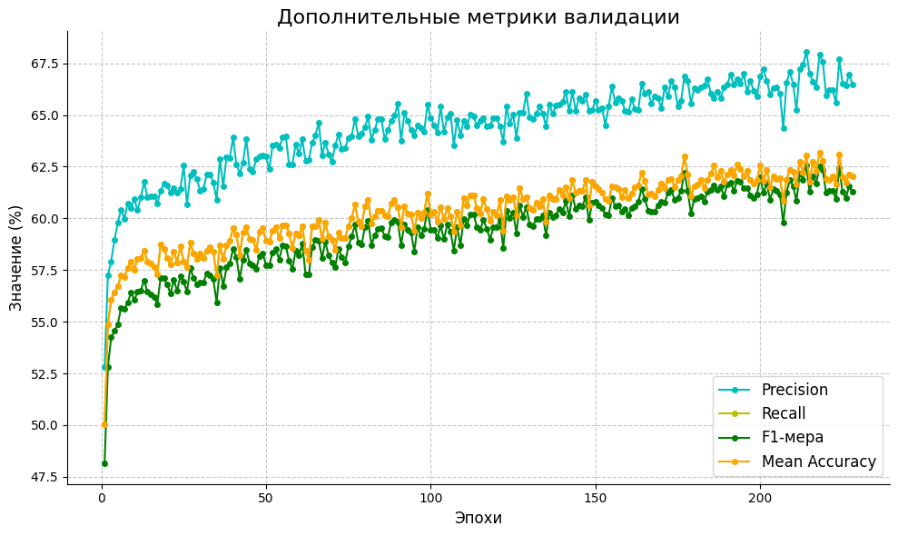

# SLR_SLOVO

# 📁 Структура проекта

```
SLR_SLOVO/
├── assetes/  # картинки для ридми
├── 📓 notebooks/           # Jupyter ноутбуки для исследования и обучения
│   ├── README.MD          # Описание архитекутры модели
│   ├── slr-v3-finetune.ipynb    # Файнтюнинг модели
│   ├── slr-v3-ft-final.ipynb   #  Файнтюнинг модели
│   └── slr-v3.ipynb       # Тренировка модели
├── 🔧 service/            # Веб-сервис для инференса
│   ├── app.py            # Streamlit-сервис
│   ├── model.py          # Загрузка и работа с моделью
│   ├── preprocess.py     # Предобработка данных     
|   └── another metadata  # json-ы необходимые для корректной работы модели
├── .gitignore  
├── Dockerfile            # Файл необходимый для запуска проекта в докере         
├── LICENSE
├── README.md    
├── requirements_d.txt   # список библиотек необходимых для запуска проекта в докере            
└── requirements_d.txt   # список библитоек необходимых для запуска проекта вручную         
```

# 🎯 О проекте  

Данный проект реализует систему распознавания русского жестового языка (РЖЯ) с использованием датасета **SLOVO**.  

## 🔍 Процесс разработки  
#### В ходе работы было протестировано **более 15 различных архитектур** (CNN, Transformer-вариации, гибридные модели), включая эксперименты с разными способами обработки ключевых точек, методами аугментации и функциями потерь. Все тесты проводились **на Kaggle в ограниченной вычислительной среде** (GPU P100/T4), что потребовало оптимизации кода и тщательного подбора гиперпараметров.  

#### Финализированная архитектура (описанная в ноутбуках) была выбрана **по совокупности метрик и скорости работы** – она показала лучший баланс между точностью (63.16% Accuracy) и ресурсоемкостью.  

## 🎓 Защита проекта  
#### Система была представлена в качестве **Выпускной квалифакционной работы** в Университете МИСИС, на кафедре **Инженерной кибернетки** по направлению **Прикладная Математика** (оценка **5/5**). [Текст работы](https://drive.google.com/file/d/1IU3wsDahYnyywR9jaR9OGWYYy7yL0LQ5)

# 🔄 Пайплайн обработки данных

#### Данные проходят следующий путь обработки:

```
Исходное видео → Обработка MediaPipe → Извлечение ключевых точек (Губы:40 | Левая рука:21 | Правая рука:21 | Поза:5) → Фильтрация кадров → Удаление пустых кадров → Сбор статистики (Расчет СРЕДНЕГО → Нормированные значения | Расчет СКО → Нормированные значения) → Трансформер модель
```


# Архитектура модели


# Более подробное описание архитектуры представлено в [РИДМИ](notebooks/README.MD) папки notebooks

[](assets/a_final.png)

# 📊 Результаты

## Метрики качества

| Метрика | Значение |
|---------|----------|
| Mean Accuracy | 63.16% |
| F1-Score | 62.56% |
| Precision | 66.47% |
| Recall | 62.04% |

## Сравнение с другими моделями на этом датасете



## Графики функции потерь и метрик




**Примечания**  
### 1) Представленные графики (Loss и Metrics) взяты из файла ноутбука третьего этапа тонкой настройки (finetune). Из-за особенностей экспорта и тренировки с чекпоинта они могут выглядеть обрезанными. Полные логи обучения, включая детализированные графики динамики метрик на всех эпохах, доступны в папке `notebooks`.
### 2) Представленные графики и метрики получены в ходе обучения на **500** классах. Замеры качества и результат работы на всём датасете(1000 классов) будут представлены позже.

# Инструкция по запуску

## Первым делом клонируем репозиторий (обязательно для любого из нижеперечисленных вариантов)

```bash 
git clone https://github.com/maksimlitvinov39kg/SLR_SLOVO.git
```

### **Вариант 1: Запуск через Podman/Docker**

#### 1. Сборка образа
```bash
podman build -t sign-language-app .
```

#### 2. Запуск контейнера с доступом к камере
```bash
podman run -it --rm \
    -p 8501:8501 \
    --device=/dev/video0:/dev/video0 \ 
    sign-language-app
```

### ИЛИ тоже самое через,но через docker
```bash
docker build -t sign-language-app .
```
```bash
docker run -it --rm \
    -p 8501:8501 \
    --device=/dev/video0:/dev/video0 \
    sign-language-app
```

> **🔹 Открыть в браузере:** [http://localhost:8501](http://localhost:8501)  

---
## Альтернативный вариант (если проблемы с докером)

### 1. Создайте виртуальное окружение

```bash
conda create -n myenv python=3.11
conda activate myenv
```

### 2. Установите зависимости

```bash
pip install -r requirements.txt
```

### 3. Запустите приложение

```bash
cd service
streamlit run app.py
```

# 🎯 Возможности сервиса

## 📹 Режим загрузки видео
- Поддерживает форматы: MP4, AVI, MOV, MKV, WebM
- Автоматически извлекает кейпоинты из всех кадров
- Показывает предварительный просмотр видео

## 📷 Режим веб-камеры
- Записывает 3-секундное видео с веб-камеры
- Показывает live-превью во время записи
- Мгновенный анализ после записи

## 📊 Результаты анализа
- Основное предсказание с уровнем уверенности
- Топ-5 наиболее вероятных классов
- Цветовая индикация уверенности модели

# 🔧 Оптимизации

## Кэширование
- **Веса модели** скачиваются только один раз при первом запуске
- **Модель** загружается в память один раз и переиспользуется
- **Экстрактор кейпоинтов** создается один раз
