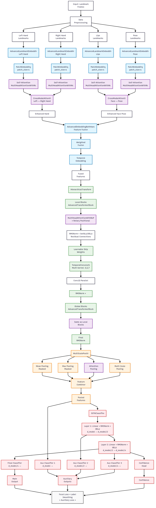

# SLR_SLOVO

Проект по распознаванию русского жестового языка с использованием глубокого обучения на датасете SLOVO.

## 📁 Структура проекта

```
SLR_SLOVO/
├── 📓 notebooks/           # Jupyter ноутбуки для исследования и обучения
│   ├── README.MD          # Описание ноутбуков
│   ├── slr-v3-finetune.ipynb    # Файнтюнинг модели
│   ├── slr-v3-ft-final.ipynb   #  Файнтюнинг модели
│   └── slr-v3.ipynb       # Тренировка модели
├── 🔧 service/            # Веб-сервис для инференса
│   ├── app.py            # Streamlit-сервис
│   ├── model.py          # Загрузка и работа с моделью
│   └── preprocess.py     # Предобработка данных
├── .venv/             
├── .gitignore           # Игнорируемые файлы
├── LICENSE              # Лицензия проекта
└── README.md          
```

## 🎯 О проекте

Данный проект реализует систему распознавания русского жестового языка (РЖЯ) с использованием датасета SLOVO. 

### 🔄 Пайплайн обработки данных

Данные проходят следующий путь обработки:

```
TBD
```

## 📊 Результаты

### Архитектура модели



### Метрики качества

| Метрика | Значение |
|---------|----------|
| Accuracy | XX.X% |
| F1-Score | XX.X% |
| Precision | XX.X% |
| Recall | XX.X% |

[//]: # "📈 Место для графиков обучения (loss, accuracy)"

### Примеры работы

[//]: # "🎥 Место для GIF/видео демонстрации работы системы"


## 🔧 Технологии


## 📈 Планы развития

- [ ] Улучшение точности модели
- [ ] Добавление поддержки режима реального времени
- [ ] Расширение словаря жестов
- [ ] Оптимизация для мобильных устройств
- [ ] Добавление API для интеграции

## 🤝 Вклад в проект

Приветствуются любые предложения по улучшению проекта! Создавайте issues и pull requests.

## 📄 Лицензия

Этот проект распространяется под лицензией MIT. См. файл `LICENSE` для подробностей.

## 🙏 Благодарности

- Авторам датасета SLOVO

---

*Создано с ❤️ для сообщества глухих и слабослышащих*