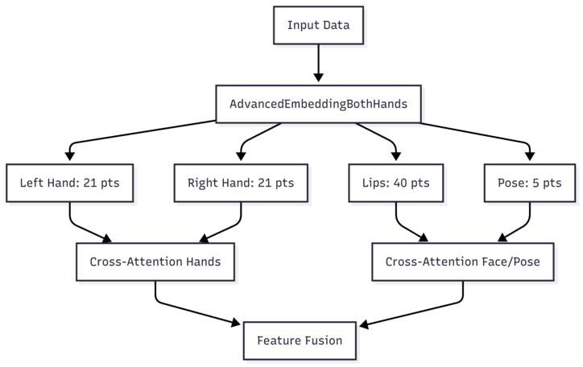
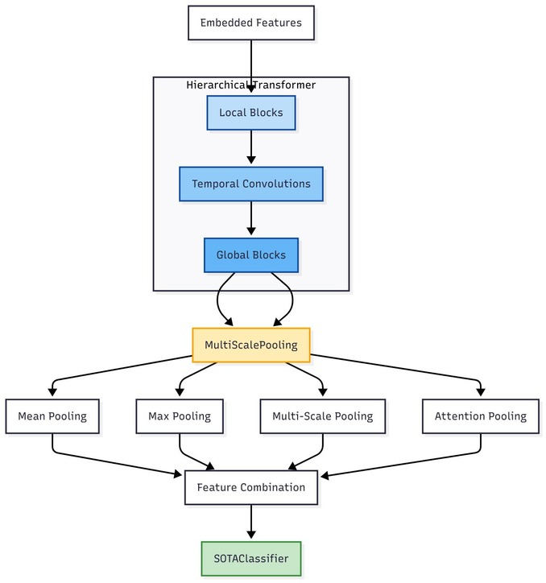

# Sign Language Recognition with Advanced Transformer

## Описание

Это проект для распознавания жестового языка с использованием современной архитектуры на основе Transformer. Модель обрабатывает видеопоследовательности с ключевыми точками лица (губы), рук (левая и правая) и позы тела для классификации жестов.

## Особенности архитектуры

### 🔧 Основные компоненты

- **Продвинутое внедрение признаков (Advanced Embedding)**: Специализированная обработка для каждого типа ключевых точек
- **Иерархический Transformer**: Комбинация локальной и глобальной обработки последовательностей
- **Rotary Position Embedding (RoPE)**: Улучшенное позиционное кодирование
- **Multi-Scale Pooling**: Агрегация признаков на разных временных масштабах
- **Cross-Modal Attention**: Взаимодействие между различными типами ключевых точек

### 🧠 Ключевые нововведения

1. **SwiGLU активация**: Современная функция активации вместо обычного GELU
2. **RMSNorm**: Нормализация Root Mean Square для стабильного обучения
3. **Focal Loss с Label Smoothing**: Устойчивая к дисбалансу классов функция потерь
4. **Адаптивные веса пропуска соединений**: Обучаемые параметры для residual connections
5. **Auxiliary Classifiers**: Дополнительные классификаторы для улучшения градиентного потока

## Структура данных

Модель ожидает данные в следующем формате:
- **Губы**: 40 ключевых точек
- **Левая рука**: 21 ключевая точка  
- **Правая рука**: 21 ключевая точка
- **Поза**: 5 ключевых точек тела

Каждая точка содержит координаты (x, y).

## Предобработка данных

### PreprocessLayerBothHands
- Удаление пустых кадров (без ключевых точек рук)
- Нормализация координат с коррекцией для рук
- Адаптивное масштабирование временных последовательностей
- Заполнение или сжатие до фиксированного размера INPUT_SIZE

## Архитектура модели

### 1. Embedding Layer (AdvancedEmbeddingBothHands)
- Отдельная обработка каждого типа ключевых точек
- Патч-эмбеддинг для эффективной обработки
- Cross-modal attention между руками и между лицом/позой
- Временное позиционное кодирование

### 2. Transformer Backbone (HierarchicalTransformer)
- **Локальные блоки**: Обработка коротких временных зависимостей
- **Temporal Convolution**: Свертки для захвата паттернов движения
- **Глобальные блоки**: Обработка долгосрочных зависимостей

### 3. Pooling Layer (MultiScalePooling)
- Среднее и максимальное пулинг
- Многомасштабное адаптивное пулинг (1, 2, 4, 8 масштабов)
- Attention-based pooling для важных временных моментов

### 4. Classifier (SOTAClassifier)
- Многослойная классификация с промежуточными признаками
- Auxiliary classifiers для каждого слоя
- Опциональная оценка уверенности (confidence estimation)

## Обучение

### Функция потерь
- **Focal Loss**: Для борьбы с дисбалансом классов
- **Label Smoothing**: Регуляризация для предотвращения переобучения
- **Auxiliary Loss**: Дополнительные потери от промежуточных классификаторов

### Оптимизация
- **CyclicLRWithWarmup**: Циклическое изменение learning rate с разогревом
- **MixUp**: Аугментация данных для улучшения генерализации

### Аугментация данных (ImprovedSignLanguageDataset)
- **Time Warping**: Изменение скорости выполнения жеста
- **Gaussian Noise**: Добавление шума к координатам
- **Scaling**: Масштабирование размера жеста

Вот дополнительный раздел, который можно добавить в конец документа:

---

## 🏆 Подробности обучения

В папке notebooks - две вложенные папки [500_classes](500_classes) и [1000_classes](1000_classes) с ноутбуками для обучения модели на 500 и 1000 классов оригинального датасета SLOVO соответственно. Каждое из обучение происходило в несколько этапов на видеокарте **NVIDIA Tesla P100 16GB** с batch_size = 32
 
1) slr_it_{num_classes}.ipynb - ноутбук с первым этапом обучения (initial training).
2) slr_ft1_{num_classes}.ipynb - ноутбук с первым этапов **дообучения** модели, полученной с ноутбка **(1)**
3) slr_ft2_{num_classes}.ipynb - ноутбук с финальным этапом **дообучения** модели, полученной с ноутбука **(2)**

 
### **500 классов**  

| Этап обучения       | Ноутбук              | Время обучения | Количество эпох | Начало эпохи переобучения | Примечания |
|---------------------|---------------------|----------------|------------------|---------------------------|------------|
| Initial Training    | `slr_it_500.ipynb`  |     4h 46m     |        169       |            -              |      -                                                    |
| Fine-Tuning 1       | `slr_ft1_500.ipynb` |     3h 29m     |       123        |             +-120/350     |обучение остановилось раньше из-за параметров early stoping|
| Fine-Tuning 2       | `slr_ft2_500.ipynb` |     6h                    25m            |         228         |         20                  |                             -                              |

**Итог:**  
- **Размер train/test выборки** 7500/2500
- **Общее время обучения:**  ~10h 40m
- **Всего эпох:**  520
- **Основная проблема / сложность:**  сильное расхождение метрики на трейне и тесте,начиная со первого этапа файнтюнинга, т.е с ~ 300/520

🔗 [Google Drive с весами модели, обученной на 500 классах ](https://drive.google.com/drive/u/1/folders/1HGNPHFkiVqxaSvYAxLQittpyBZiwuGcU)
---  

### **1000 классов**  

| Этап обучения       | Ноутбук               | Время обучения | Количество эпох | Начало эпохи переобучения | Примечания |
|---------------------|----------------------|----------------|------------------|---------------------------|------------|
| Initial Training    | `slr_it_1000.ipynb`  |     7h 18m           |     100             |      -                     |    -        |
| Fine-Tuning 1       | `slr_ft1_1000.ipynb` |      9h 27m          |     130             |        -                   |     -       |
| Fine-Tuning 2       | `slr_ft2_1000.ipynb` |       10h 57m         |      150            |        ~75                   |     -       |

**Итог:**  
- **Размер train/test выборки** 15015/5005
- **Общее время обучения:**  ~ 27h 50m
- **Всего эпох:**  380
- **Основная проблема / сложность:**  сильное расхождение метрики на трейне и тесте,начиная со первого этапа файнтюнинга, т.е с ~ 300/380

🔗 [Google Drive с весами модели, обученной на 1000 классах ](https://drive.google.com/drive/folders/1DOi0FKmL1eWTkNj8EFcTaJQ58k1kREjx)
---
## Возможные идеи для предотвращения перобучения и улучшения качества модели:

### 🔧 Улучшенная аугментация данных
1. **Пространственные аугментации**:
   - Координатный dropout (случайное обнуление некоторых ключевых точек)
   - Локальное искажение координат
   - Зеркальное отражение жестов (с переключением меток левой/правой руки)

2. **Временные аугментации**:
   - Random temporal cropping (вырезка случайных отрезков)
   - Non-linear time warping (нелинейное изменение скорости)

3. **Физически-корректные преобразования**:
   - 3D-вращение скелета в пространстве
   - Перспективные искажения (имитация разных углов камеры)
   - Добавление "реалистичного" шума (имитация ошибок детекции)

### 🎛 Оптимизация процесса обучения
1. **Улучшенные шедулеры**:
   - CosineAnnealingWithWarmRestarts
   - OneCycleLR с разными максимумами для разных слоев
   - Плато-ориентированное снижение LR (ReduceLROnPlateau)

2. **Регуляризация**:
   - Stochastic Depth (случайное отключение слоев)
   - LayerDrop для трансформер-блоков
   - Более агрессивный weight decay (отдельно для норм-слоев)

3. **Модификации функции потерь**:
   - Curriculum Focal Loss (постепенное увеличение γ)
   - Pairwise margin loss для сложных классов
   - Self-distillation с предыдущими чекпоинтами

### 🧠 Архитектурные улучшения
1. **Модификации внимания**:
   - Local window attention для временной оси
   - Sparse attention patterns

2. **Мультимодальные улучшения**:
   - Cross-modal consistency loss

